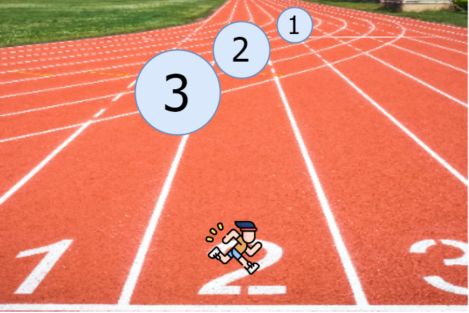
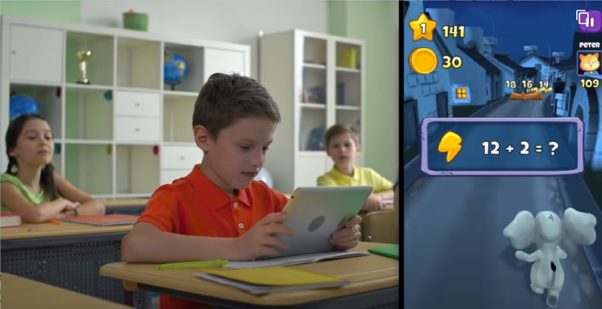
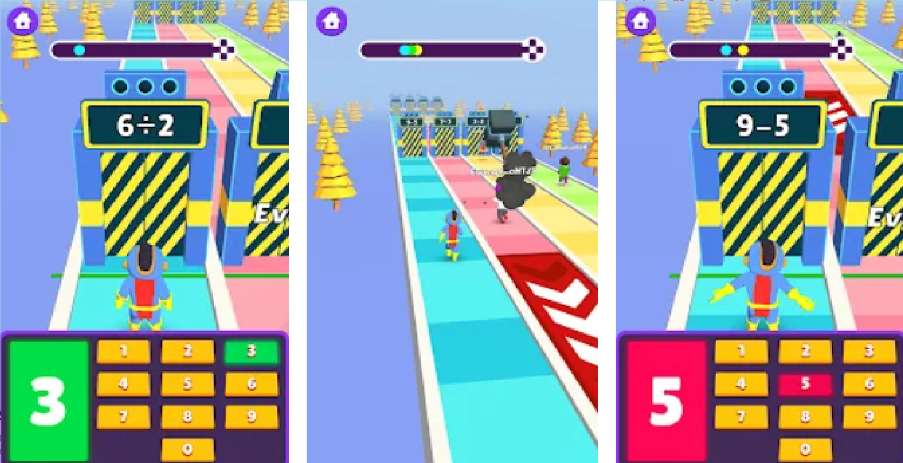
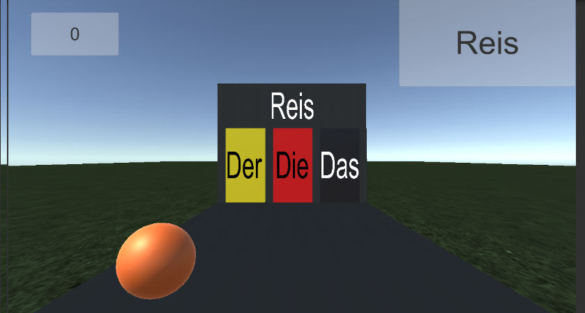

# AmiRunner

Prepare for you Amiram test while playing!

## Game Purpose 

This is a classic endless runner game aimed at the israeli students in order to prepare them for the Amiram test which is one of the most crucial tests of any academy degree. The player will run endlessly on a track which will have English quizes and vocabulary tests as it's main obstacles. The game will get harder and harder as the player proceeds. 

> Platform: The game will support mobile and PC platforms as well. 

---

## Game Character

### 1. Players

* The game is aimed for hebrew speakers who want to learn english. It's for any age but mainly focused towards high school students and above that needs a cool and fun way to learn english and prepare for their Amiram test.
* This is a single player game
* The only interaction between the players in the online leaderboard that will mark out the best performersץ This will add a competitive flavour to the game.

### 2. Targets

* The main goal of the player is to get as far as possible in the game, the further he reaches in the track the more points he gets. 
* The game is very straight forward and the moment the player starts to play he will show him the first english question, he's score and a floating message tell him to RUN!
* The player cannot choose other game targets and goals.

### 3. Procedure

* The first seconds of the game show a big timer on the screen and the player will start running slowly on the track. A dramatic music will start to play and the game will begin with the first English question for the player. The first question will be very easy one which will give any player a positive feeling for it's first few seconds, a feeling he will want to keep getting for the rest of the game.
> **For the first few questions there will be arrows on the screen and alerts guiding the player about the moves he needs to do in order for the player to learn the game core mechanism**

>Controls: The game have only four basic moves the player can do, up, down, left or right. On the mobile platform this is will initiated with a stroke of the finger to the right direction and on the PC with pressing the arrow key to the right direction. This will make the player move to the desired direction or jump/crawl over or under obstacles.
* The game core mechanism is answering english questions as an endless track obstacles. 
* The game cannot end, it will just get faster and harder to a level it will be nearly impossible to answer the questions. 

### 4. Rules

* There are only two rules
1. Do not hit any obstacles.
2. Choose the right answer for the current question.

* Both of the rules affect the game results, the player needs to be ready for any obstacle or question any time.
* The first seconds of the game will run a guided tutorial for the player to learn the rules, after feeling ready to play without the rules the tutorial can be turned off from the game settings. 

### 5. Resources

* There is only one resource in this game and it's the players **three** life points.
* The more life points the player has the more points he accumulates as he is making progress through the game. The number of lives will have linear factor on the points gained. 
* There is no way to get a new life point within the game.
* The game design make the life points the most rare resource by making them unavailable inside the game, the only way to receive a life point is to start a new game.
There will be an HUD showng the lide points the player has on the screen. 

### 6. Conflicts

* The conflicts between the player and the system are the english questions and the obstacles on the track. After making a progress the game speed will be a major obstacle as well.
* There are no other players playing actively so there are no conlicts between players.
* The main conflict between a player to himself is rather he is running towards the right answer or not knowing that making the wrong choice may gravely affect the game score.

### 7. Limits

* This is a close world game, the player can choose between three track lanes to run on and cannot get out of the track. 
There will be straight lines on the track showing the limits and the direction. Because the player is always running in one direction and is always guided to the next obstacle and question he is being guided by the game core mechanism and this is what that will create the positive emotions and feedback within the players mind.
 
### 8. Results

* The game can end in only one way, the player losing all his life points. What will determine the current track is the game score the player received and the score options are endless.
* The games score is purely dependant on the players knowledge and skills. The is no luck factor in this game at all. The better english knowledge the player has, and the faster he can compute the right answer, the better score he will get. 
* This is a zero sum game

---

## Market Research

> For this research we queried the key words "endless runner language teaching game", "runner english game", "hebrew english endless runner" and "endless runner learn" on Google, Google play store and Steam.

### Toon Math: Math Games
https://play.google.com/store/apps/details?id=com.closeapps.mathrun

This is the most popular educational endless running game we found online. Our targeted audience is different from this game because we aim directly at hebrew speakers which want to learn english and thus we will be more attractive to that audience.

### Math Runner
https://play.google.com/store/apps/details?id=hypercasual.mathematics.runner

Like the game above, this game is also one of the most popular educational endless runner games. Our game is more attractive from the same reason we are targeting a very specific audience that as of today, does not have an alternative.

### 3. Der Die Das Endless Runner
https://thundares.itch.io/der-die-das-endless-runner

This game is one of the only educational endless runner games we've found that is aimed at teaching language. It's an indie game and probably the most similar game to what we want to develope. Out game will be far superior due to the score and leaderboard mechanism, addint some competitive mechanism and againg we are aiming at a specific audience with no other solution. 

> Good source found while researching:
https://itch.io/games/tag-educational/tag-infinite-runner

Icons made by <a href="https://www.freepik.com" title="Freepik">Freepik</a> from <a href="https://www.flaticon.com/" title="Flaticon">www.flaticon.com</a>
